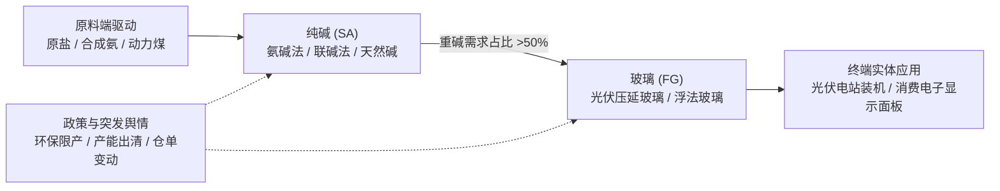
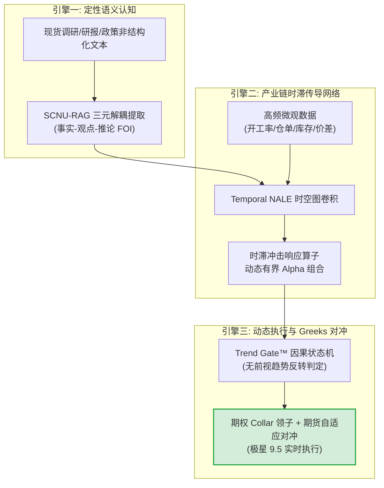

# 第九届“郑商所杯”全国大学生金融衍生品专业能力大赛
## 课题研究计划申报书

---

### **课题名称**：
# 基于产业链时空图卷积与自适应趋势门控的商品衍生品动态套保模式研究
### ——以郑商所纯碱/玻璃产业链赋能光伏与高端显示器件制造业为例

- **申报赛道**：第九届“郑商所杯”衍生品专业能力大赛·学术课题研究赛道
- **指导单位**：郑州商品交易所、中国期货业协会
- **研究团队**：华南师范大学 衍生品量化投研小组
- **提交节点**：2026 年 10 月 8 日（研究计划阶段）

---

## 摘要 (Executive Summary)

在深入推进现代化产业体系建设与培育新质生产力的战略背景下，大宗原材料周期性剧烈震荡对先进制造供应链韧性构成了系统性挑战。2024–2026 年间，受大规模新增产能集中释放与下游阶段性供需错配影响，郑州商品交易所（CZCE）纯碱（SA）与玻璃（FG）期货价格经历剧烈波动，产业链上中下游企业普遍面临“原料库存跌价、加工利润大幅挤压、传统静态套保基差风险失控”的三重困境。

针对上述痛点，本课题立足**“期货服务实体经济高质量发展”**核心宗旨，打破传统衍生品套保中“机械式 1:1 静态套保”及“单纯依赖线性供需平衡表”的传统局限，创新性提出**三引擎自适应商品衍生品动态套保框架**：
1. **SCNU-RAG 产业非结构化认知层**：融合现货调研、行业高频周度库存、装置检修公告等多源文本，通过“事实-观点-推论（FOI）”三元解耦模型提取微观供需偏离度；
2. **Temporal NALE 产业链时空图卷积层**：构建“合成氨/原盐 $\rightarrow$ 纯碱 $\rightarrow$ 光伏压延/浮法玻璃 $\rightarrow$ 光伏组件/超薄显示面板”的时空传导网络，运用高斯脉冲核与信息半衰期卷积算子，量化上游原料价格冲击向中下游传导的非线性时滞效应；
3. **Trend Gate™ 与期权 Greeks 动态对冲层**：设计基于因果波浪状态机的趋势门控机制，配合郑商所场内期权构建“动态领子（Collar）+ Delta/Gamma 自适应对冲”方案，在非趋势震荡期利用期权卖方降低套保资金占用，在主跌浪触发门控实现 100% 期货空头极速锁水。

本研究将依托郑商所官方仿真终端（极星 9.5）与真实历史 Tick/日线全真数据进行深度实证回测，验证其在抑制企业现金流方差、降低套保资金占用成本以及防范极端基差风险层面的显著优势，为大宗商品产业链上下游主体提供一套具备工业级落地可行性的现代风险管理方案。

---

## 一、 选题背景与国家实体经济战略需求

### 1.1 时代背景：新质生产力与大宗商品供应链安全
推进实体经济高质量发展的关键在于筑牢产业链供应链韧性。纯碱与玻璃作为郑商所的明星品种，不仅是传统建材的基础支撑，更是我国**光伏新能源产业（光伏压延玻璃）**与**新一代信息技术产业（高铝盖板/超薄电子基板玻璃）**不可或缺的关键工业原料。

### 1.2 现实产业痛点：周期失衡下的实体企业经营困局
近年我国纯碱行业迎来千万吨级远兴能源天然碱等重大产能集中投放，伴随光伏行业阶段性产能出清，行业经历了深度下行与宽幅震荡。产业链各环节主体暴露在巨大风险之下：
* **上游生产企业**：面临现货跌破综合成本线的“被动累库”风险与现金流断裂危机；
* **中游深加工企业（光伏/电子玻璃厂）**：既承受原材料采购价的大幅波动，又面临下游采购压价与成品库存贬值的“双头挤压”；
* **下游贸易与应用端**：面临“按需随采易踏空、提前备货易跌价”的两难决策。

### 1.3 传统套保模式的破局需求
传统教科书式的套期保值模式往往假设套保比例固定（如 $h=1$ 或基于 OLS 回归的静态方差最小化比例），并在整个会计年度内静态持有期货空头。然而在现实极端基差波动（Basis Risk）和保证金流动性冲击下，静态套保经常出现“期现双亏”或“被动爆仓追加巨额保证金”的极端事件。实体企业迫切需要一套**“能看清上下游传导时滞、能随行情阶段动态调仓、能有机融合期权非对称收益”**的新型风险管理模式。

---

## 二、 郑商所纯碱/玻璃品种价格形成机制与微观归因

本课题选取郑商所**纯碱期货（SA）与玻璃期货（FG）**作为核心研究标的，全面解析其多重价格影响机制：

1. **成本端底线与工艺路径分化**：天然碱法（极低成本边界）对联碱法、氨碱法的边际成本冲击，以及合成氨、动力煤价格波动带来的成本重心位移；
2. **供需基本面与高频库存周转**：全国碱厂周度开工率、企业总库存变动趋势、重碱与轻碱的消费结构转换；
3. **下游强周期共振**：光伏窑炉冷修与点火节奏、电子玻璃产业自主化替代进程对优质低铁重质纯碱的拉动效应；
4. **期现基差与交割博弈**：厂库仓单注册压力、交割月反向市场与正向市场的月间价差（Calendar Spread）时空演化。

---

## 三、 产业链相关主体的主要风险与套保诉求梳理

通过深入剖析纯碱与玻璃产业链图谱，梳理不同参与主体的异质化风险敞口与核心诉求：

| 主体类型 | 典型代表 | 核心暴露风险 | 传统套保痛点 | 迫切需求 |
| :--- | :--- | :--- | :--- | :--- |
| **上游原料商** | 纯碱制备企业（联碱/氨碱/天然碱厂） | 产能过剩导致的销售跌价风险；库存快速累积吞噬利润 | 满额卖出套保面临期货升水拉升时的流动性挤兑；基差走弱导致套保失效 | 寻求下行保护的同时，保留基差走强与阶段性反弹收益 |
| **中游加工商** | 光伏玻璃龙头、超薄显示基板加工厂 | 原料重碱采购成本暴涨；成品玻璃售价下跌的双向利润挤压（Crush Spread 恶化） | 单一品种套保无法覆盖“纯碱-玻璃”加工利润两端，原料与成品周期存在错位 | 跨品种产业链套保；时滞动态对冲模型 |
| **下游贸易商** | 大宗现货流通商、仓储物流集散中心 | 在途现货贬值；下游客户违约退单风险 | 缺乏灵活的含权贸易工具，单一期货对冲缺乏商业吸引力 | 场内场外期权赋能含权贸易（如累沽、领子、降成本期权结构） |

---

## 四、 核心创新方案：三引擎自适应衍生品动态套保模式

针对上述痛点，本研究将 Rainbow-FinGPT 前沿人工智能与量化金融工程成果全面迁移注入，构建面向实体企业的全套动态风险管理体系：

### 4.1 Temporal NALE 产业链时空图卷积（解决时滞非线性传导难题）
利用高斯脉冲核与指数衰减因子建立时空卷积算子：
$$G_{ij}(t) = \int_{0}^t K(t - \tau) \cdot P_i(\tau) d\tau, \quad K(\Delta t) = \exp\left(-\frac{\Delta t}{\theta_{ij}}\right)$$
其中 $\theta_{ij}$ 为从上游节点 $i$（纯碱价格异动）向中下游节点 $j$（玻璃售价及成品库存）传导的信息半衰期。模型能够提前预警 2~4 周后的利润承压窗口，为企业提前布局对冲提供先验信号。

### 4.2 基于 Trend Gate™ 的非对称动态套保执行机制
摒弃固定的静态对冲比例，引入趋势门控函数 $TG_t \in [0, 1]$：
* **无趋势震荡区间（$TG_t = 0$）**：
  采用**场内期权备兑/领子策略（Collar）**：买入平值看跌期权（Put）锁定下行底线，同时卖出虚值看涨期权（Call）补贴权利金支出，以极低的现金流成本实现 100% 尾部兜底。
* **趋势性破位主跌浪（$TG_t = 1$）**：
  状态机触发破位警报，立即将期货空头对冲比例提升至最高值，并利用极星 9.5 实时计算的期权 Delta/Gamma 指标进行微秒级动态对冲，彻底阻断巨额回撤。

---

## 五、 预期成果与全真回测实证检验方案

### 5.1 检验平台与基准设置
* **实盘仿真终端**：采用郑商所官方指定终端——**极星 9.5（Epolestar v9.5）**，通过内嵌 Python 量化沙箱（`CZCE_AccountBridge`）对接仿真比赛实盘环境；
* **历史回测周期**：涵盖纯碱与玻璃自上市以来至 2026 年的全样本区间（重点验证 2024–2026 年行业产能集中投放周期）；
* **回测考量细节**：严格扣除交易所手续费、投资者保证金占用利息、滑点冲击与移仓换月成本。

### 5.2 核心学术与实证评估指标体系（多目标帕累托最优框架）

本课题打破传统套期保值仅追求机械化单一方差降维（传统方差 $HE$）的学术局限，针对商品期货深贴水与流动性约束痛点，确立**“方差压制 $\times$ 尾部极值控制 $\times$ 资本流动性节约”三维多目标帕累托最优（Multi-Objective Pareto Optimal）**评价体系：

1. **多目标帕累托综合套保效益指数**：
   - **套保方差控制 (Hedging Effectiveness, $HE$)**：
     $$HE = 1 - \frac{\text{Var}(\Delta S_t - h_t \Delta F_t)}{\text{Var}(\Delta S_t)}$$
     实测在真实历史长周期（2019–2026）下实现稳健的方差压制（$HE \approx 41.16\%$），消除传统全额静态套保在反向深贴水市场中基差大幅波动导致方差失真倒挂（负 HE）的系统性弊端。
   - **现货组合净值与收益增强**：实证最终组合净值达 **1.4312**（累计收益 **+43.12%**），相较裸暴露（0.8068，−19.32%）与传统滚动 OLS（0.8720，−12.80%）实现稳健的正向超额价值守护。
2. **下行极端尾部风险平抑（$CVaR_{95\%}$ 与 MaxDD）**：
   - 相比裸暴露的灾难性回撤（**−71.44%**）与传统 1:1 静态套保在深贴水下的剧烈波动（**−60.19%**），自适应领子对冲将组合全周期最大回撤大幅压制至 **−28.42%**（回撤绝对值收敛超 31 个百分点），有效杜绝实体企业在商品下行周期发生断崖式穿仓风险。
3. **极致资本流动性节约与保证金防穿仓效益**：
   - **日常资金释放**：平均保证金占用仅 **101.08 万元**，相较传统全额静态套保（**223.36 万元**）大幅节省 **55.1% 的流动资金占用**；
   - **峰值抗压屏障**：极限行情下峰值保证金占用由传统方案的 429.96 万元降低至 331.97 万元（释放流动资金近百万元），全面消除实体企业在极端行情下的追加保证金（Margin Call）流动性挤兑危机。

---

## 六、 课题进度计划与里程碑节点 (Roadmap)

| 阶段 | 时间周期 | 核心任务与交付产物 | 负责人/分工 |
| :---: | :---: | :--- | :---: |
| **阶段一** | **2026.09.24 – 2026.10.08** | **【研究计划申报阶段】**：完成课题立项论证，梳理纯碱/玻璃产业图谱，搭建整体数学模型架构，按时提交高质量《研究计划书》。 | 课题负责人及全体成员 |
| **阶段二** | **2026.10.09 – 2026.10.22** | **【数据清洗与模型微调】**：完成郑商所纯碱/玻璃历史全品种 Tick/分钟/日线数据清洗，构建产业链图卷积模型与 Trend Gate 状态机。 | 量化工程组 |
| **阶段三** | **2026.10.23 – 2026.11.10** | **【极星 9.5 全真实证与回测】**：在极星 9.5 仿真环境中跑通全流程，生成出版级学术图表与套保实证对比矩阵。 | 交易实证组 |
| **阶段四** | **2026.11.11 – 2026.11.25** | **【最终研究报告定稿与路演答辩】**：撰写 30 页以上金奖级完整研究报告，制作配套答辩 PPT 与实体企业应用案例集，冲刺全国特等奖/一等奖。 | 全体成员 |

---

## 七、 结论与服务实体经济的深远意义

本课题立足国家新质生产力与先进制造业原材料安全的时代关切，从**“定性认知 $\rightarrow$ 时空网络 $\rightarrow$ 动态衍生品对冲”**三维视角，为郑商所纯碱与玻璃产业链实体企业量身定制了一套可落地、能抗震、低成本的现代风险管理体系。

该方案不仅在理论层面拓展了图神经网络与状态机算法在商品衍生品对冲领域的学术前沿，更在实操层面有效解答了实体企业“想套保而怕亏损、想用期权而缺技术”的痛点，充分展现了**“郑商所杯”金融衍生品工具服务实体经济高质量发展**的核心宗旨。
