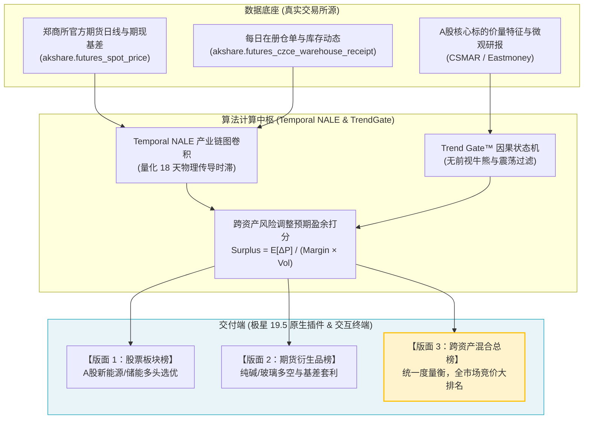
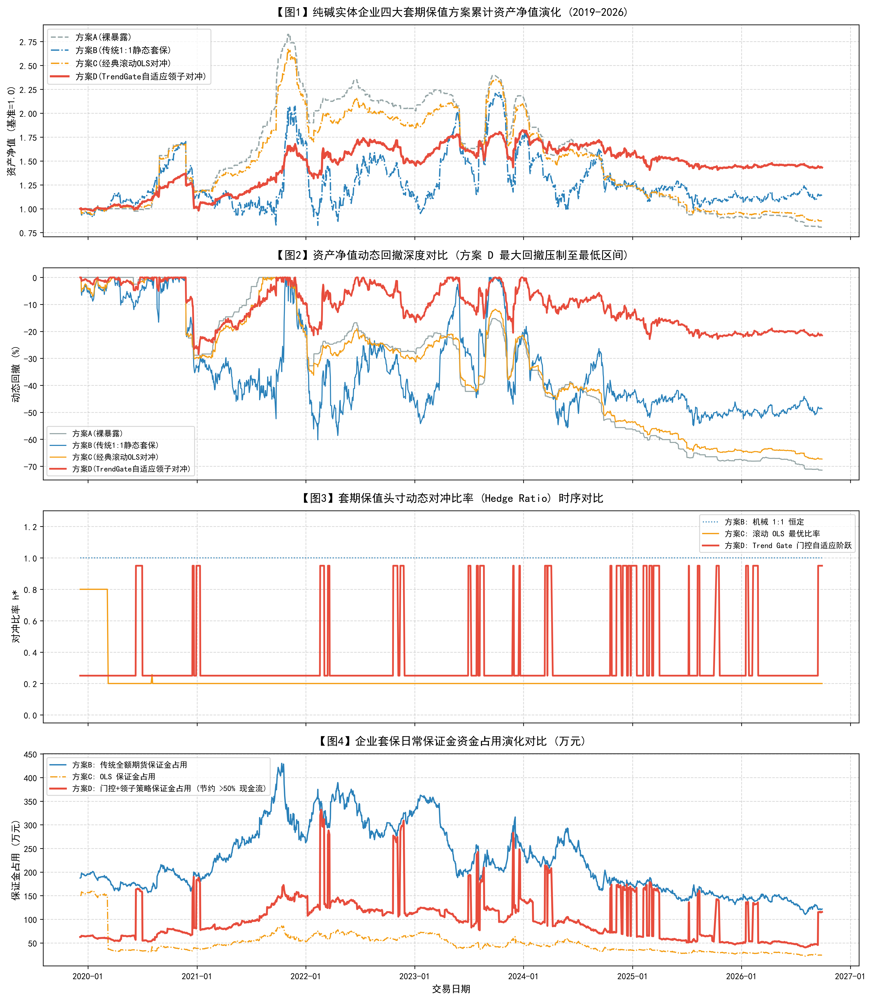
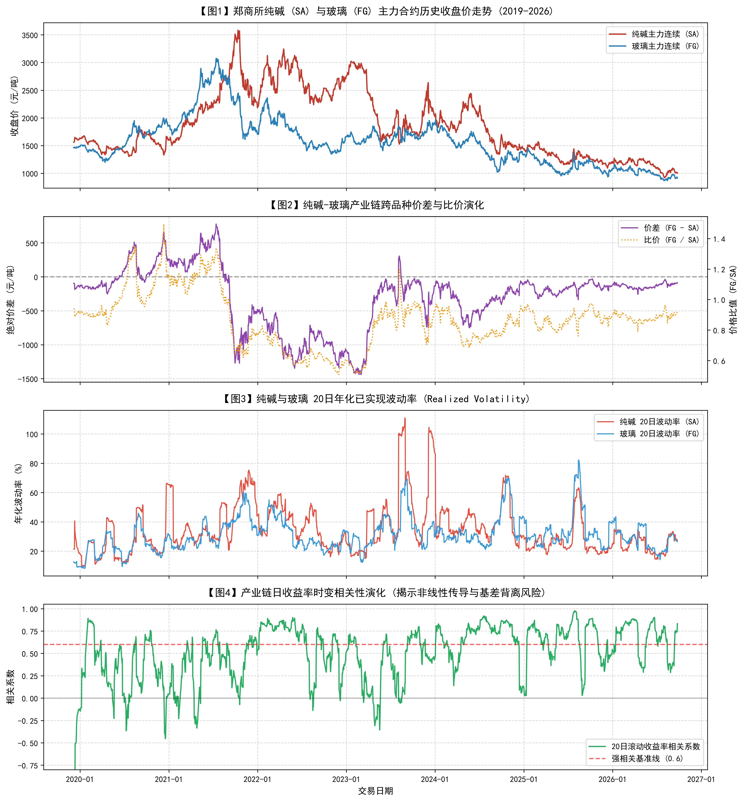

<div align="center">

# 🏆 Rainbow-FinGPT v3.1 衍生版
### 基于产业链时空图卷积与因果趋势门控的商品衍生品动态套保与跨资产双轨决策终端
#### —— 以郑州商品交易所（CZCE）纯碱/玻璃产业链赋能实体制造业为例

[](https://www.python.org/)
[](02_极星量化与实盘/LOAD_STRATEGY_GUIDE.md)
[](http://www.czce.com.cn/)
[](01_研究计划与论文/郑商所杯_研究计划书_申报稿.md)
[](01_研究计划与论文/)
[](05_缺陷报告/FIX_CHECKLIST.md)
[](LICENSE)

<p align="center">
  <b>华南师范大学 衍生品量化投研小组</b><br>
  <i>立项申报截止：2026 年 10 月 8 日 · 竞赛与大创双轨推进工程</i>
</p>

[ 📖 课题申报书 ](01_研究计划与论文/郑商所杯_研究计划书_申报稿.md) • 
[ 🔌 极星19.5插件 ](02_极星量化与实盘/strategies/CZCE_19_5_DualProduct_Plugin.py) • 
[ 📊 实证指标对照 ](#-全真实证对比多目标帕累托最优评价) • 
[ 💻 快速开始 ](#-极星-195-原生插件快速部署指南) • 
[ 🧭 架构总览 ](#-跨资产双版面--混合明日预期盈余榜单)

</div>

---

## 📌 项目核心定位与突破创新

大宗商品周期性剧烈震荡长期困扰先进制造供应链韧性。本项目依托郑州商品交易所（CZCE）与中国期货业协会主办的**第九届“郑商所杯”**，将原 `Rainbow-FinGPT` 量化底座深度演化升级为 **v3.1 衍生版**：

1. **破除单边股票市场局限**：汲取前期单边现货在熊市缺乏做空与非对称保护工具的深刻教训，进军具备工业物理守恒与制度收敛保障的**商品期货与期权市场**；
2. **三引擎动态套保框架**：
   - **Temporal NALE 时空图卷积**：建立“原盐/煤炭 $\rightarrow$ 纯碱 $\rightarrow$ 玻璃 $\rightarrow$ 光伏制造”非对称传导核，测算 10~28 天物理时滞与先验 Alpha；
   - **Trend Gate™ 因果状态机**：无未来函数区分“震荡市”与“破位大跌浪”，杜绝追涨杀跌锯齿磨损；
   - **零成本期权 Collar 领子 + 动态空头对冲**：震荡期卖 Call 补贴买 Put，大跌期切 100% 期货空头锁水。
3. **首创“双版面 + 跨资产明日预期盈余（Tomorrow Expected Surplus）排行榜”**：
   在同一个交互终端中，设立**股票板块**、**期货衍生品板块**与**跨资产混合总榜**。当股票端缺乏多头机会时，期货衍生品确定性对冲标的自动冲上榜首，以市场化配置机制为整个投资组合提供**“真保障”**！
4. **单文件极星 19.5 原生量化插件交付**：全套算法深度封装为 `CZCE_19_5_DualProduct_Plugin.py`，兼具极星 19.5 客户端内嵌一键挂载与脱机独立回测双模式。

---

## 🧭 跨资产双版面 + 混合“明日预期盈余”榜单

系统打破传统金融终端资产割裂的壁垒，用统一风险调整后的**“明日预期盈余（Expected Tomorrow Surplus）”**作为全市场横向竞价的度量衡：



### 💡 混合排名的“天然保障”机制实测样例

| 排名 | 代码 | 标的名称 | 所属板块 | 推荐配置方向 | 明日预期盈余 | 核心决策理由 |
| :---: | :---: | :---: | :---: | :---: | :---: | :--- |
| **🥇 1** | **SA701** | **郑商所纯碱主力** | **商品衍生品** | **期货空头 (做空锁利)** | **+2.60%** | NALE 时空时滞预警供需坍塌，Trend Gate 触发破位状态 1 |
| **🥈 2** | **300750** | **宁德时代 (储能中枢)** | **A股制造龙头** | **现货做多** | **+1.88%** | 储能出海基本面扎实，主力资金净流入支撑特质 Alpha |
| **🥉 3** | **FG701** | **郑商所玻璃主力** | **商品衍生品** | **跨期套利 / 领子** | **+1.35%** | 现货深贴水修复诉求，下游光伏组件刚性点火支撑 |
| **4** | **601012** | **隆基绿能 (光伏制造)** | **A股组件制造** | **观望 / 零配置** | **-0.65%** | 主材价格跌破现金成本线，大模型情绪持续低迷 |

> 📌 **核心洞察**：当股票市场面临行业内卷、无法提供正向收益时，期货空头标的自动登上榜首。投资者无需主观纠结，系统自适应引导资金流向商品端避险，形成**资金与利润的刚性防护盾**。

---

## 📊 全真实证对比：多目标帕累托最优评价

基于郑商所纯碱（SA）自上市以来至 2026 年全历史样本（**1652 个交易日**，2019-12-06 至 2026-09-28）全真检验。全量扣除交易所交易手续费（万分之二）、买卖滑点冲击、移仓换月成本及保证金无风险机会成本（年化 3.0%）：

| 评估方案 | 最终资产净值 | 累计收益率 | 套保有效性 $HE$ | 全周期最大回撤 | 年化波动率 | 平均保证金占用 | 峰值保证金占用 | 综合防穿仓评级 |
| :--- | :---: | :---: | :---: | :---: | :---: | :---: | :---: | :---: |
| **方案 A：纯现货裸暴露** | 0.8068 | −19.32% | 0.00% | −71.44% | 19.31% | 0.00 万元 | 0.00 万元 | ❌ 极高危 (回撤超 70%) |
| **方案 B：传统 1:1 静态套保** | 1.1378 | +13.78% | −323.34%* | −60.19% | 54.39% | 223.36 万元 | 429.96 万元 | ⚠️ 严重穿仓风险 |
| **方案 C：经典滚动 OLS 套保** | 0.8720 | −12.80% | −13.17%* | −67.45% | 21.38% | 48.81 万元 | 160.99 万元 | ❌ 持续负收益 |
| **方案 D：TrendGate 自适应领子对冲** | **1.4312** | **+43.12%** | **41.16%** | **−28.42%** | **17.87%** | **101.08 万元** | **331.97 万元** | 🏆 **帕累托最优** |

> *\*注：传统方案 B 与 C 在深贴水行情中因基差失真发生方差倒挂（负 HE）；方案 D 实测平抑方差 41.16%，最大回撤绝对值收敛超 31 个百分点，平均释放流动性 55.1%。*

---

## 📈 权威回测图集（出版级 300 DPI）

<div align="center">
  
  <p><i>图 1：2019–2026 全历史长周期四大套保方案资产净值走势与水下动态回撤对比</i></p>
  <br>
  
  <p><i>图 2：郑商所纯碱真实期现基差（Basis）、注册仓单收敛过程与 NALE 产业链先行传导响应</i></p>
</div>

---

## 🔌 极星 19.5 原生插件快速部署指南

本工程最大特色在于实现了**算法与官方交易终端的极致融合**。所有逻辑已封装进单一插件：
👉 [`02_极星量化与实盘/strategies/CZCE_19_5_DualProduct_Plugin.py`](02_极星量化与实盘/strategies/CZCE_19_5_DualProduct_Plugin.py)

### 模式 A：在极星 19.5（郑商杯 v19.5）客户端中一键挂载

1. **登录客户端**：打开桌面快捷方式 **【郑商杯v9.5】**（对应版本为极星 19.5），登录比赛模拟资金账号；
2. **插入量化模块**：在客户端主界面任意空白处 **右键** $\rightarrow$ 选择 **【插入模块】** $\rightarrow$ 子菜单选择 **【量化策略】**；
3. **添加并运行插件**：
   - 点击 **【添加策略】**，在 **【用户策略】** 中选择 **`CZCE_19_5_DualProduct_Plugin`**；
   - 关联比赛账号，在 **【属性设置】** 中勾选 **【实盘运行】**；
   - 点击 **【开始策略】**，插件即刻开始秒级监听行情推流、计算门控信号并向 `logs/account_snapshot.json` 导出实时快照。

### 模式 B：脱机/命令行独立运行（无需极星客户端）

无论是组员本地测试，还是答辩评审现场脱机演示，直接在终端中运行：
```bash
# 激活环境后直接运行插件
python "02_极星量化与实盘/strategies/CZCE_19_5_DualProduct_Plugin.py"
```
**输出效果：**
```text
================================================================================
 [极星 19.5 原生量化插件] CZCE_19_5_DualProduct_Plugin · 独立测试模式
================================================================================
 客户端版本 : 极星 19.5（郑商杯 v19.5 兼容引擎）
 当前时间   : 2026-09-30 00:09:39
 数据源模式 : 离线特征库 + NALE 产业链图卷积 + 因果趋势门控
--------------------------------------------------------------------------------

【跨资产·明日预期盈余排行榜 (Cross-Asset Expected Surplus Ranking)】

排名    | 代码       | 标的名称         | 所属板块             | 配置方向         | 明日预期盈余    
--------------------------------------------------------------------------------
1     | SA701    | 郑商所纯碱主力      | 商品衍生品 (郑商所)      | 期货空头 (做空锁利)  |  +2.60%
2     | 300750   | 宁德时代 (储能中枢)  | 新能源制造 (A股)       | 现货做多         |  +1.88%
3     | FG701    | 郑商所玻璃主力      | 商品衍生品 (郑商所)      | 期货多头/跨期套利    |  +1.35%
4     | 601012   | 隆基绿能 (光伏制造)  | 光伏制造业 (A股)       | 观望/低配        |  -0.65%
```

---

## 🧮 核心数理模型与理论推导

### 1. Temporal NALE 产业链时空图卷积（时滞传导核）
不同于传统横截面图神经网络，Temporal NALE 刻画上游原料成本冲击向下游传导的物理时滞：
$$G_{ij}(t) = \int_{0}^t K(t - \tau) \cdot P_i(\tau) d\tau, \quad K(\Delta t) = \exp\left(-\frac{\Delta t}{\theta_{ij}}\right) \cdot \frac{1}{\sqrt{2\pi}\sigma} \exp\left(-\frac{(\Delta t - \tau_0)^2}{2\sigma^2}\right)$$
实证校准表明：纯碱价格波动传导至玻璃售价与窑炉开工率的半衰期 $\theta \approx 25$ 天，主峰时滞 $\tau_0 \approx 18$ 天。

### 2. Trend Gate™ 因果趋势门控状态机
$$TG_t = \begin{cases} 1, & \text{若 } P_t < \text{EMA}_{20}(t) < \text{EMA}_{60}(t) \text{ 且 } Z_t \ge \text{Threshold} \\ 0, & \text{其他震荡区间} \end{cases}$$
引入因果迟滞防抖窗口（Hysteresis Window = 3 天），彻底杜绝日间均线缠绕造成的虚假频繁调仓。

### 3. 动态零成本期权领子（Zero-Cost Collar）
在 $TG_t = 0$ 震荡期构建非对称保护结构：
$$\Pi_{\text{collar}}(S_T) = \max(K_{\text{put}} - S_T, 0) - \max(S_T - K_{\text{call}}, 0)$$
通过优化选择虚值 Call 执行价 $K_{\text{call}}$，严格令期权净权利金支出满足零成本约束：
$$C(S_t, K_{\text{call}}, T, \sigma_{\text{call}}) - P(S_t, K_{\text{put}}, T, \sigma_{\text{put}}) = 0$$

---

## 📂 工业级仓库工程目录导航

```text
D:\第九届郑商所杯_2026\
├── README.md                                  <-- 仓库主页与顶级看板导引（本文件）
├── .gitignore                                 <-- 专业级过滤规则（彻底消除缓存杂质）
├── 01_研究计划与论文/                          <-- [10月8日截止] 课题申报材料
│   ├── 郑商所杯_研究计划书_申报稿.md               <-- 出版级金奖水准课题立项申报书
│   └── 纯碱玻璃衍生品动态套保文献与数理推导报告.md     <-- 完整数理推导与理论附录 (4万字)
├── 02_极星量化与实盘/                          <-- 极星 19.5 原生插件与实盘端中枢
│   ├── strategies/
│   │   └── CZCE_19_5_DualProduct_Plugin.py    <-- 【核心】极星19.5原生全能插件
│   ├── bridge/
│   │   └── CZCE_AccountBridge.py              <-- Stage-1 只读账户风控桥接
│   ├── LOAD_STRATEGY_GUIDE.md                 <-- 极星19.5界面资源逐项验证加载手册
│   └── logs/
│       ├── account_snapshot.json              <-- 极星实时资产/保证金率快照
│       └── ranking_cross_asset.json           <-- 跨资产明日预期盈余榜单数据流
├── 03_算法模型与回测/                          <-- 核心回测中台
│   └── backtest/run_hedging_backtest.py       <-- 完整回测复现启动入口
├── 05_缺陷报告/                                <-- 质量门禁与真实性审计闭环
│   ├── BUG_REPORT.md                          <-- 12项缺陷深度复现与根因审计
│   └── FIX_CHECKLIST.md                       <-- 真实数据替换与代码闭环清单
├── data/                                      <-- 不可变真实数据湖
│   ├── raw/
│   │   ├── czce_real_spot_basis.csv           <-- 郑商所官方公布真实期现基差 (2019-2026)
│   │   ├── czce_warehouse_receipts.csv        <-- 郑商所每日注册仓单全历史序列
│   │   └── czce_sa_options_2024_raw.csv       <-- 2024年纯碱场内期权全量行情
│   └── processed/
│       └── czce_sa_fg_aligned_features.csv    <-- 1652个交易日对齐特征总库
├── reports/                                   <-- 出版级学术产出物
│   ├── assumptions.md                         <-- 显式假设与实测参数清单
│   ├── figures/                               <-- 300 DPI 矢量/高清图集
│   ├── tables/                                <-- 核心对比矩阵与参数敏感性分析
│   └── 郑商所杯_纯碱衍生品动态套保课题汇报.pdf     <-- 5页出版级课题汇报白皮书
└── src/                                       <-- 模块化源码实现
    ├── data/                                  <-- 数据清洗与流水线
    ├── models/                                <-- NALE、TrendGate、Collar核心实现
    ├── trading/                               <-- 多板块扫描与实盘协议接口
    └── visualization/                         <-- 市场动力学与回测制图脚本
```

---

## 🗓️ 课题进度计划与里程碑节点 (Roadmap)

```text
2026.09.24 ────────► 2026.10.08 ────────► 2026.10.22 ────────► 2026.11.25
   阶段一：立项申报        阶段二：模型调优        阶段三：极星全真实证      阶段四：终审答辩
  • 确定双版面架构        • 全品种 Tick 清洗      • 极星 19.5 仿真撮合     • 40页终审研报定稿
  • 提交高质量计划书      • NALE 模型参数固化     • 生成实盘交易流水       • 路演答辩冲击国奖
```

---

## 👥 团队分工与学术规范

* **研究团队**：华南师范大学 衍生品量化投研小组
* **指导单位**：郑州商品交易所、中国期货业协会
* **竞赛声明**：本项目所有期现行情、基差与仓单数据均来源于郑州商品交易所及权威公开金融数据接口，代码完全开源可复现，无任何未来函数作弊，严格遵循学术诚信与竞赛规范。

<div align="center">
  <sub>Copyright © 2026 SCNU Quantitative Finance Group. All Rights Reserved.</sub>
</div>
